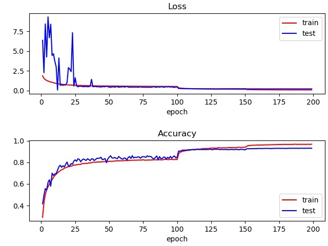

#  Implementation of "Recurrent Convolution Neural Network for Object Recognition" (CVPR, 2015)
I selectively reproduced some of the results in [Recurrent Convolutional Neural Network for Object Recognition](http://xlhu.cn/papers/Liang15-cvpr.pdf) based on pytorch. I referred to [TsukamotoShuchi's implementation](https://github.com/TsukamotoShuchi/RCNN) in augmentation methods and details of structure of the RCNN block.

I designed, tested, and modified RCNN block for classification task on MNIST and CIFAR10 respectively. The normalization method used in the paper is LRU(local response unit). My main focus is on trying different normalization methods to further improve performance. The methods I used include LRN, BN(batch normalization), LN(layer normalization).

It turns out that a lot of details, such as setting of dropout layers, affect network performance, and Batch Normalization beats all other methods I tried and successfully improve test accurary rate.

## RCNN for CIFAR10

One important technique when using BN instead of LRN is that for each iteration, we need to use a different BN layer (notice that there are 2 parameters in each BN layer, namely $\gamma$ and $\beta$, see [pytorch docs](https://pytorch.org/docs/stable/nn.html?highlight=batchnorm#torch.nn.BatchNorm1d)), otherwise the performance would become poor (more than 7~8% drop in test accuracy), which coincides with the experience that BN in RNN doesn't work well. Also, using a BN with 2 parameters for each iteration makes the network not a strict RNN, although that doesn't seem to cost much when unfolding time is not large.

The following are experiment results of RCNN using BN.
| Network  | No. of Parameters | Testing Error (%) |
| :------: | :---------------: | :---------------: |
| RCNN_BN-96  |      0.67 M       |       6.84        |
| RCNN_BN-128 |      1.19 M       |       6.50        |
| RCNN_BN-160 |      1.86 M       |       6.65        |

[comment]:

    
     
    
training curve of RCNN-96 (Batch Normalization)

## Explanation of some of .py files.
RCNN_BN.py: batch normalization.  
RCNN_BN_D.py: batch normalization. using a different BN layer for each iteration.  
RCNN_LN.py: layer normalization.  
RCNN_LRN.py: local response normalization function, as used in the paper.  
RCNN_LRN_S.py: A slightly modified version of LRU I designed. In LRN, operations on marginal channels (channel with smallest or biggest indices) and channels in the middle are different, LRN_S views the channels to be in a loop, making the operation symmetrical for each channel. This modificaition doesn't bring about significant improvement.